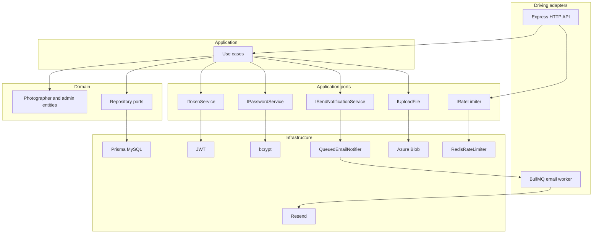
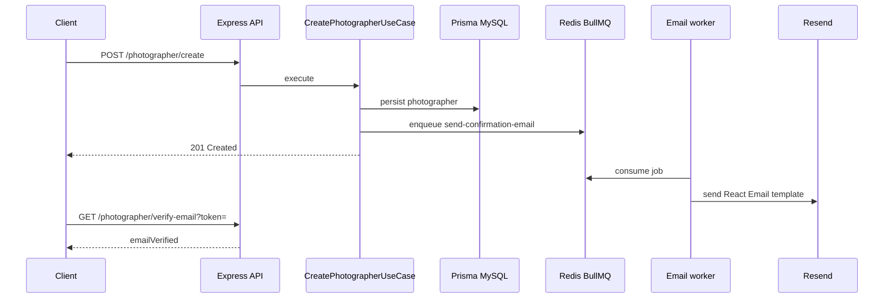
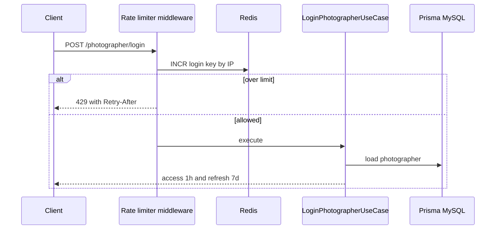

# LensFlow

TypeScript backend for photographer accounts, built with hexagonal architecture.

[](https://github.com/nicolasandreos/Photographer-API/actions/workflows/ci.yml)


LensFlow is the API behind a photography-studio SaaS: photographers register, verify email, sign in, and manage a profile. The domain stays independent of Express, Prisma, Redis, Resend, and Azure, so those details can change without rewriting business rules.

This repository is the **identity, auth, and profile** slice of that product. CRM, scheduling, and AI automation are on the roadmap — they are not implemented here.

- Interactive API docs: `GET /docs`
- Health check: `GET /health`

## Table of contents

- [Features](#features)
- [Tech stack](#tech-stack)
- [Architecture](#architecture)
- [How a request flows](#how-a-request-flows)
- [Infrastructure](#infrastructure)
- [Getting started](#getting-started)
- [Environment variables](#environment-variables)
- [API surface](#api-surface)
- [Tests](#tests)
- [CI/CD](#cicd)
- [Roadmap](#roadmap)

## Features

- Photographer registration, email verification, login, and profile update
- Profile picture upload to Azure Blob Storage (`jpg` / `jpeg` / `png`, max 5 MB)
- Password-reset email plus an HTML form to set a new password
- Administrator create/login, with an admin-only photographer listing
- JWT access tokens (1 h) and refresh tokens (7 d)
- Redis rate limiting on photographer login
- Asynchronous email via BullMQ and Resend
- Swagger UI and a `/health` endpoint

## Tech stack

| Area | Choice |
| --- | --- |
| Runtime | Node.js 22, TypeScript, ESM |
| HTTP | Express 5, Zod validation |
| Persistence | Prisma 7, MySQL (`@prisma/adapter-mariadb`) |
| Auth | `jsonwebtoken`, bcrypt (cost 10) |
| Queue and limits | BullMQ + ioredis |
| Email | Resend + React Email |
| Storage | Azure Blob Storage |
| Tests | Vitest, Supertest |
| Local infra | Docker Compose (MySQL + Redis) |
| Delivery | GitHub Actions, Azure Container Apps |

## Architecture

Hexagonal architecture (ports and adapters) keeps the core of the system free of framework code.

- **Domain** holds entities and repository interfaces. It does not import Express, Prisma, or Redis.
- **Application** holds use cases. They depend on ports (`ITokenService`, `IPasswordService`, `ISendNotificationService`, `IUploadFile`, `IRateLimiter`), not on vendors.
- **Infrastructure** implements those ports: Prisma, JWT, bcrypt, a queued email notifier, Azure Blob, Redis rate limiting, Resend.
- **Driving adapters** are the HTTP API and a separate email worker process.

`PhotographerUseCasesFactory` is the composition root. It injects `PrismaPhotographerRepository`, `PasswordService`, `JwtTokenService`, `QueuedEmailNotifier`, and `AzureStorageAdapter` into the use cases so controllers stay thin.



### Project layout

```
src/
├── domain/           # entities and repository ports
├── application/      # use cases and outbound ports
├── infra/            # adapters, factories, Prisma, Redis, queues, email templates
├── api/              # Express routes, controllers, DTOs, middleware, Swagger
├── workers/          # BullMQ email worker (separate process)
├── exceptions/       # typed HTTP exceptions
└── tests/            # unit and integration tests
```

## How a request flows

### Registration and email verification

The HTTP process never talks to Resend directly. It enqueues a job and returns. A worker retries failed sends (3 attempts, exponential backoff) so a brief email outage does not fail registration.



1. `POST /photographer/create` hashes the password and stores the photographer with `emailVerified = false`.
2. `QueuedEmailNotifier` pushes `send-confirmation-email` onto the BullMQ `email` queue in Redis.
3. `src/workers/email.worker.ts` picks up the job and `EmailNotificationAdapter` sends the message through Resend.
4. The photographer opens `/photographer/verify-email?token=...`. The email-verification JWT (24 h) is checked and the account is marked verified.

Login is blocked until that verification succeeds.

### Login and rate limiting



`POST /photographer/login` is the only rate-limited route. The middleware keys Redis as `login:<ip>` with `INCR`, `EXPIRE`, and `TTL` (default **5 requests / 60 seconds**, overridable via env). Responses include `X-RateLimit-Limit` and `X-RateLimit-Remaining`; when the window is exhausted they also include `Retry-After`.

If the request is allowed, the use case requires a verified email, checks bcrypt, and issues JWTs.

## Infrastructure

### Prisma and MySQL

Schema: [`prisma/schema.prisma`](prisma/schema.prisma). Two models, no relations yet:

- `photographers` — UUID, unique email, password hash, phone, optional studio name, `isActive`, `emailVerified`, optional profile blob name
- `administrator_users` — UUID, unique email, password hash

Runtime uses `@prisma/adapter-mariadb` with `DATABASE_HOST`, `DATABASE_USER`, `DATABASE_PASSWORD`, `DATABASE_PORT`, and `DATABASE_NAME` (optional `DATABASE_SSL=true`). Migrations and seed use `DATABASE_URL`.

```bash
npx prisma migrate deploy
npm run db:seed
```

### Redis: queue and rate limit

One Redis instance, two jobs.

**Email queue.** Queue name `email`. Jobs: `send-confirmation-email` and `send-change-password-email`. Producer: `QueuedEmailNotifier`. Consumer: the worker process. Jobs retry 3 times with exponential backoff starting at 2 seconds.

**Login rate limit.** `RedisRateLimiter` implements `IRateLimiter` with a fixed window (`INCR` + `EXPIRE` + `TTL`). Wired only to photographer login.

The API process **produces** jobs. Emails are **not** sent unless you also run:

```bash
npm run start:worker
```

### Resend

`EmailNotificationAdapter` sends mail through Resend using React Email templates:

| Trigger | Job | Template | Link env var |
| --- | --- | --- | --- |
| Photographer created | `send-confirmation-email` | pending confirmation | `EMAIL_VERIFICATION_URL` |
| Authenticated password-reset request | `send-change-password-email` | change password | `FORM_CHANGE_PASSWORD_URL` |

The API also serves HTML pages for verification success and the change-password form (those are not Resend templates).

### Auth and storage

Four JWT secrets, four lifetimes:

| Token | Env var | TTL |
| --- | --- | --- |
| Access | `JWT_SECRET_KEY` | 1 hour |
| Refresh | `JWT_REFRESH_SECRET_KEY` | 7 days |
| Email verification | `JWT_EMAIL_VERIFICATION_SECRET_KEY` | 24 hours |
| Change password | `JWT_CHANGE_PASSWORD_SECRET_KEY` | 1 hour |

Protected routes expect `Authorization: Bearer <access-token>`. Listing all photographers also requires the caller to exist as an administrator.

Profile pictures go to Azure Blob Storage. Multer accepts a `photo` field up to 5 MB; the use case allows `jpg`, `jpeg`, and `png` only. The blob name is stored on the photographer; public URLs are built from `AZURE_STORAGE_PUBLIC_BASE_URL`.

## Getting started

**Prerequisites:** Node.js 22, Docker.

1. Start MySQL and Redis (dev MySQL on **3310**, test MySQL on **3311**, Redis on **6379**):

   ```bash
   docker compose up -d
   ```

2. Copy environment files:

   ```bash
   cp .env.example .env
   cp .env.example .env.test
   ```

   For `.env.test`, point `DATABASE_URL` / `DATABASE_*` at port **3311** and database `photostudio_test` (see [Environment variables](#environment-variables)). Fill in Resend and Azure keys if you want those paths to work locally.

3. Install dependencies (`postinstall` runs `prisma generate`):

   ```bash
   npm install
   ```

4. Apply migrations to the dev database:

   ```bash
   npx prisma migrate deploy
   ```

5. Optional — load sample photographers:

   ```bash
   npm run db:seed
   ```

6. Run the API **and** the email worker (two terminals):

   ```bash
   npm run dev
   npm run start:worker
   ```

7. Check `http://localhost:3000/health` and `http://localhost:3000/docs`.

Confirmation emails leave the box only when the worker is running and `RESEND_API_KEY` is set. The Resend test domain (`onboarding@resend.dev`) can send to the account that owns the API key.

### Scripts

| Script | Purpose |
| --- | --- |
| `npm run dev` | API with `tsx watch` |
| `npm start` | API without watch |
| `npm run start:worker` | BullMQ email worker |
| `npm run db:seed` | Seed MySQL |
| `npm run lint` | ESLint |
| `npm run typecheck` | `tsc --noEmit` |
| `npm test` | Unit + integration |
| `npm run test:unit` | Unit tests only |
| `npm run test:integration` | Integration tests (needs MySQL + Redis) |
| `npm run test:migrate` | `prisma migrate deploy` using `.env.test` |

## Environment variables

Copy [`.env.example`](.env.example). Do not commit real `.env` files.

| Variable | Used for |
| --- | --- |
| `APP_PORT` | HTTP listen port |
| `SWAGGER_SERVER_URL` | Swagger server URL |
| `DATABASE_URL` | Prisma migrate and seed |
| `DATABASE_HOST` | Runtime MySQL host |
| `DATABASE_USER` | Runtime MySQL user |
| `DATABASE_PASSWORD` | Runtime MySQL password |
| `DATABASE_PORT` | Runtime MySQL port (Compose maps 3310 → 3306) |
| `DATABASE_NAME` | Runtime database name |
| `DATABASE_SSL` | Optional; set `true` to require SSL |
| `REDIS_URL` | BullMQ and rate limiting |
| `JWT_SECRET_KEY` | Access tokens |
| `JWT_REFRESH_SECRET_KEY` | Refresh tokens |
| `JWT_EMAIL_VERIFICATION_SECRET_KEY` | Email verification tokens |
| `JWT_CHANGE_PASSWORD_SECRET_KEY` | Password-reset tokens |
| `RESEND_API_KEY` | Resend |
| `EMAIL_VERIFICATION_URL` | Link in the confirmation email |
| `FORM_CHANGE_PASSWORD_URL` | Link in the change-password email |
| `REQUEST_RATE_LIMIT_MAX` | Max login attempts per window (default 5) |
| `REQUEST_RATE_LIMIT_WINDOW_SECONDS` | Window length (default 60) |
| `AZURE_STORAGE_CONNECTION_STRING` | Blob uploads |
| `AZURE_STORAGE_CONTAINER_NAME` | Blob container |
| `AZURE_STORAGE_PUBLIC_BASE_URL` | Public profile-picture URL prefix |

The app loads `.env` then `.env.development`. Tests load `.env.test`.

## API surface

Interactive docs: **`/docs`**. Routes below are the source of truth in `src/api/routes`.

### Photographer — `/photographer`

| Method | Path | Auth | Notes |
| --- | --- | --- | --- |
| `POST` | `/create` | Public | Register; enqueues verification email |
| `POST` | `/login` | Public + rate limit | Requires verified email |
| `GET` | `/verify-email` | Public | Query `token`; HTML confirmation |
| `GET` | `/all` | Bearer + administrator | List photographers |
| `GET` | `/:id` | Public | Get by id |
| `PUT` | `/me` | Bearer | Update own profile |
| `PUT` | `/me/profile-picture` | Bearer | Multipart field `photo` |
| `PUT` | `/send-change-password-email` | Bearer | Enqueues reset email |
| `GET` | `/change-password-form` | Public | Query `token`; HTML form |
| `POST` | `/change-password` | Public | Query `token`; body `newPassword`, `confirmPassword` |
| `DELETE` | `/:id` | Public | Delete by id |

### Auth — `/auth`

| Method | Path | Notes |
| --- | --- | --- |
| `POST` | `/refresh` | Body `{ "refreshToken": "..." }` → new access token |

### Administrator — `/administrator-user`

| Method | Path | Notes |
| --- | --- | --- |
| `POST` | `/create` | Create administrator |
| `POST` | `/login` | Administrator login |

## Tests

Vitest runs two projects (`fileParallelism: false`):

| Project | Location | What it covers |
| --- | --- | --- |
| `unit` | `src/tests/unit` | Use cases (create photographer, change password, upload picture, refresh token), JWT service, Redis rate limiter, rate-limiter middleware. No live MySQL or Redis required. |
| `integration` | `src/tests/integration` | HTTP API (photographer + auth) and Prisma photographer persistence. Needs Compose MySQL test + Redis and `.env.test`. |

```bash
npm run test:unit
docker compose up -d --wait mysql_database_test redis
npm run test:migrate
npm run test:integration
```

`npm test` runs both projects. Integration tests fail if `.env.test` is missing or Redis/MySQL are down.

## CI/CD

**CI** (every push and pull request): lint → typecheck → unit tests → start MySQL test + Redis via Compose → Prisma migrate → integration tests.

**CD** (push to `main`): build a Docker image, push it to Azure Container Registry, run `prisma migrate deploy` against the production database, and update an Azure Container App. Secrets stay in GitHub Actions and Azure — they are not in this repository.

The API container and the email worker are separate processes. Production needs both if you want outbound email.

## Roadmap

Not implemented in this codebase. Planned for the LensFlow product:

- Lead and client CRM (WhatsApp, Instagram, and other inbound channels)
- Scheduling, quotes, contracts, and payments
- Photo delivery after the shoot
- AI assistance: lead extraction, conversation summaries, and photographer-specific FAQs

The current backend is the foundation those modules can plug into through the same ports-and-adapters boundary.

## Author

**Nicolas Andreos**

License: ISC
